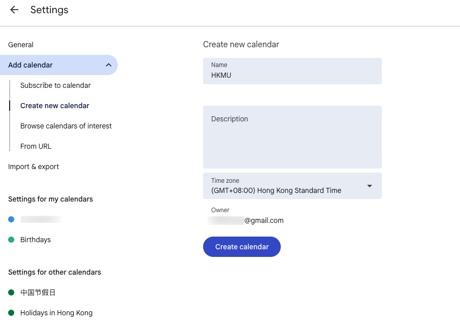
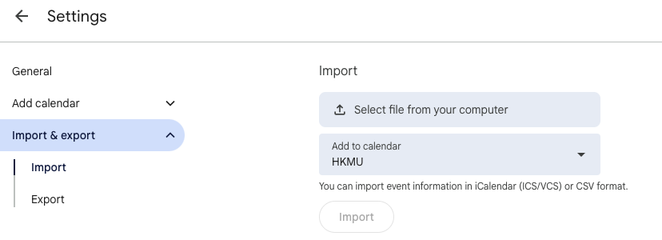

# HKMU Syncalendar - Chrome Extension

A Chrome extension that intercepts and imports calendar events from the HKMU OLE calendar to Google Calendar format.

## Features

- [ ] Locally imports calendar events from HKMU calendar to Google Calendar
- [x] Automatically syncs calendar events with the Google Calendar API

## Locally Import

Go to the OLE platform and navigate to the calendar webpage. The extension will automatically intercept the calendar events.

### Pop up the Extension Panel

Once you export the events data, the extension will automatically convert the OLE-specific calendar events to standard Google Calendar format. 

### Import Events to Google Calendar

We recommend creating a separate Google Calendar.

Then import the events to the calendar.

## One-click Sync

todo