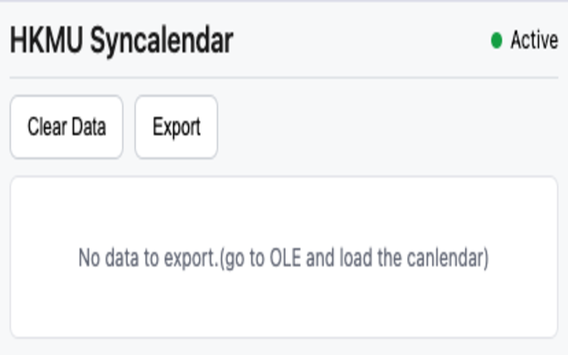
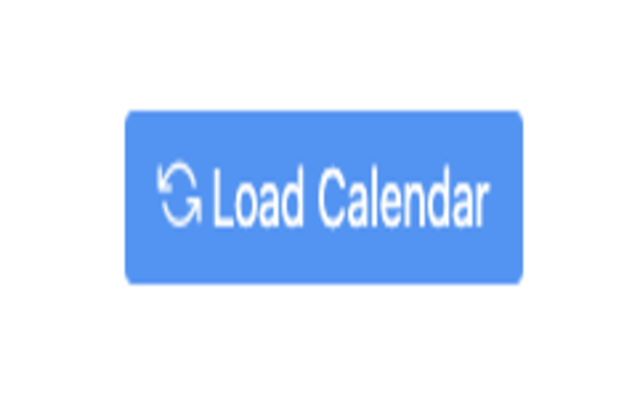
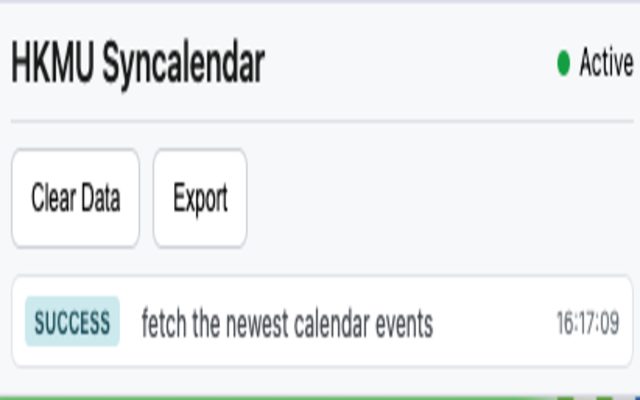
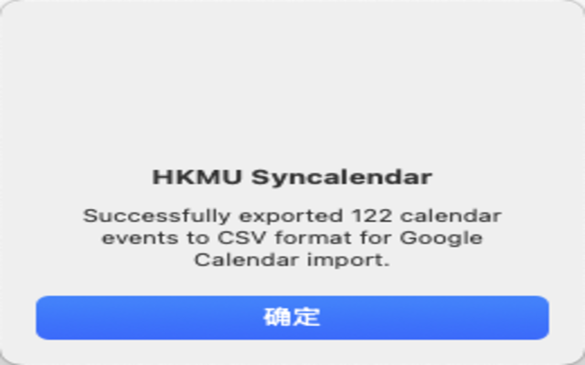

# OLE Syncalendar - Chrome Extension

A Chrome extension that intercepts and imports calendar events from the HKMU OLE(Oline learning Environment) calendar to others like Google calendar or Outlook canlendar, etc.

## Features

- [x] Locally imports calendar events from HKMU calendar to Google Calendar
- [ ] Automatically syncs calendar events with the Google Calendar API

## Locally Import

Go to the OLE platform load calendar directly or navigate to the calendar webpage. The extension will automatically intercept the calendar events.

Then extension has intercepted the calendar events.

Once you export the events data, the extension will automatically convert the OLE-specific calendar events to standard Google Calendar format. 

The next step is to import the events to the google calendar